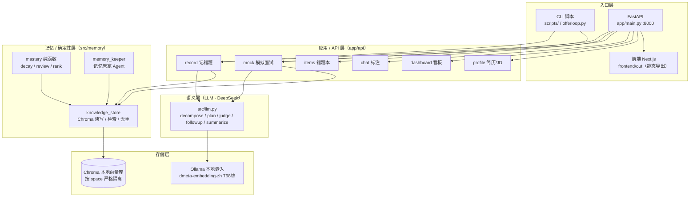
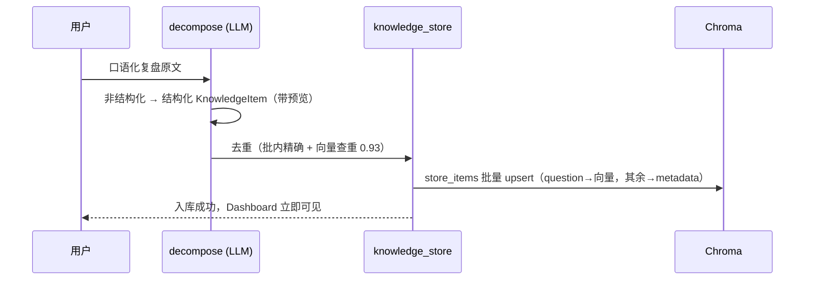
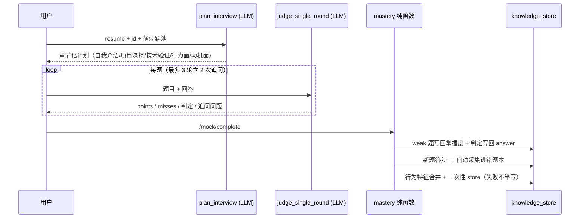

# OfferLoop —— 带长期记忆的面试陪练 Agent

> **一句话**：一个「记得你」的面试错题本——自动采集你的面试弱点，用遗忘曲线跟踪每道题的掌握度，在快忘时主动提醒，再用你的简历 + JD + 错题本出结构化模拟面试、诊断「面试为什么会崩」。

---

## 项目简介

应届生面完试，错题散在聊天记录里，**忘了就忘了**。OfferLoop 把面试复盘自动拆成结构化错题，跟踪每道题的掌握度，**在快忘的时候主动提醒你复习**——而不是让你手动整理、自己记着去复习。

它的内核不是一个「存了什么就给你什么」的静态题库，而是一个**会遗忘、会主动推送的 Agent**：

- **记忆引擎**：每道错题带掌握度，按艾宾浩斯遗忘曲线衰减（`mastery × e^(-λt)`），复习答对回升、答错封顶；双因子排序让「最该复习的题」永远排第一，复习成果自动回流。
- **主动性**：按遗忘状态动态分层（🔴 快忘了 / 🟡 该看看），只提醒 Top K 薄弱题，而不是无差别推全部。
- **结构化面试官**：基于简历 + JD + 错题本 + 结构化方法论（STAR / 宝洁八大问）出题，章节化流程 + 递进追问，结束后生成复盘报告，诊断「答非所问」「简历与表现脱节」这类单道题记不出来的系统性毛病。

**别人回答「市场在考什么」，OfferLoop 回答「你现在还差什么」。**

---

## 核心能力

| 能力 | 说明 | 是否 Agent 内核 |
|------|------|----------------|
| 记一道错题（录入 / 编辑 / 删除） | 口语化复盘 → LLM 拆解 → 预览 → 入库 | ❌ 纯 CRUD |
| **动态遗忘分层 + 主动提醒** | 系统**根据遗忘状态决定该提醒什么**，不是你主动来查 | ✅ 是 |
| **自适应三源模拟面试** | 出题计划随「你的简历 + JD + 当前薄弱点」动态变化 | ✅ 是 |
| **自动采集新弱点** | 面试中答差的新题自动回流错题本，越用越懂你 | ✅ 是 |
| 面经冷启动补给 | 导入网上面经（只有题、无自评），填补「还没错题时」的空白 | ❌ 数据喂养 |
| 多空间隔离 | `--space` 一键开独立空间，试玩不污染正式记忆 | ❌ 工程 |

---

## 效果展示

**面试前提醒（实时按遗忘状态分层，不是写死的清单）：**

```
📋 面试前提醒（字节 · AI应用开发）
   你之前在这 7 道题上栽过，按遗忘程度分层：

🔴 快忘了（2 道，优先看）：
   [FAIL  ] RAG 混合检索怎么做的？  (混合检索)  18 天没复习
      ⚠️ 行为提醒：表达绕弯
   [PARTIAL] 线程池核心参数怎么定？  (线程池)    21 天没复习

🟡 该看看（3 道）：
   [FAIL  ] Redis 缓存击穿怎么防？  (缓存)      9 天没复习
   ...

✅ 最近刚看过 2 道，掌握度还高，暂不提醒。
```

**模拟面试复盘报告（诊断系统性毛病）：**

```
【整体评价】候选人对项目细节掌握扎实，但在「线程池参数权衡」上被追问后暴露理解断层。
【共性建议】STAR 行为题偏「讲经历」而非「讲取舍」，建议补「为什么这么做」的因果链。
🎯 薄弱主题：RAG、线程池、缓存击穿
```

---

## 应用场景

- **面试前复习**：跑提醒，专看快忘的薄弱题，把下一场的剩余价值最大化。
- **秋招陪练**：上传目标公司 JD + 自己的简历，来一场结构化模拟面试，提前暴露「简历写得好但讲不出」的脱节。
- **复盘沉淀**：每次真实面试后粘贴复盘，自动变成可追溯、带掌握度的错题本。
- **行为画像**：跨多次面试累积行为特征（答不到点 / 表达绕弯 / 回避问题），下次提醒自动带上。

---

## 安装部署

### 方式一：让 AI 帮你装（最简单）

如果你在用 WorkBuddy / Claude / Codex 这类智能体，直接说：

> 「帮我在 D:\AIWorkspace\OfferLoop\offerloop 里装好 OfferLoop 的运行环境，配好 .env」

智能体会自动创建虚拟环境、装依赖、拉本地嵌入模型、写配置。

### 方式二：脚本安装

```bash
# 1. 后端（Python 3.13）
cd offerloop
python -m venv .venv && source .venv/bin/activate        # Windows: .venv\Scripts\activate
pip install -e .                                        # 运行时依赖
# 开发模式（含 pytest / ruff）：
pip install -e ".[dev]"

# 2. 本地嵌入模型（Ollama，必装）
#    安装 Ollama 后拉取 768 维中文嵌入模型：
ollama pull shaw/dmeta-embedding-zh:latest

# 3. 前端（Next.js，可选；只用 CLI 可跳过）
cd frontend
npm install
npm run build      # 静态导出到 frontend/out，由后端统一托管
```

### 方式三：手动安装

```bash
# 依赖见 pyproject.toml：fastapi / uvicorn / chromadb / openai /
# pandas / hdbscan / scikit-learn / pydantic / python-dotenv /
# pypdf / python-multipart / jinja2
pip install fastapi uvicorn chromadb openai pydantic python-dotenv pypdf python-multipart

# 配置：复制环境变量模板并填入你的 DeepSeek Key
cp .env.example .env
# 编辑 .env：DEEPSEEK_API_KEY=sk-xxx
```

> **前置要求**：① 本地运行 Ollama 且已拉取 `shaw/dmeta-embedding-zh:latest`；② 一个 DeepSeek API Key（用于云端推理）。**面试数据全部存本地 Chroma，不出本机。**

---

## 快速开始

```bash
# —— CLI 模式 ——
python offerloop.py                 # 说人话：记错题 / 模拟面试 / 看提醒 / 看复盘
python offerloop.py --space 试玩     # 独立空间，试玩不污染正式记忆

# —— Web 模式 ——
uvicorn app.main:app --host 0.0.0.0 --port 8000
# 浏览器打开 http://localhost:8000  （/api/* 与前端同源单进程托管）
```

> Web 模式默认只起后端即可：前端 `frontend/out` 已由 `app/main.py` 托管。
> 开发时想热更新前端，另开一个终端 `cd frontend && npm run dev`（3000，自动代理 `/api` 到 8000）。

---

## 使用说明

### 1. 记错题（采集 → 入库）

- **Web**：「记错题」页粘贴复盘文本（或上传 `.txt/.md` 面经）→ 实时拆解预览 → 确认入库。
- **CLI**：`python offerloop.py` 后说「今天面了字节，被问了 RAG 混合检索，没答上」。
- 入库前自动去重（批内精确 + 对库向量查重，阈值 0.93），避免重复污染错题本。

### 2. 模拟面试（自适应出题 → 判定 → 写回）

- **Web**：「模拟面试」页先上传简历 PDF / JD（`.pdf/.md/.txt`），点开始 → 按章节预览出题计划 → 逐题作答 → 可「追问」（最多 2 轮）→ 结束生成复盘报告。
- **CLI**：`python -m src.mock`。中途崩溃？`python -m src.mock --recover` 幂等补写，掌握度不重复涨。

出题四层依据：

| 来源 | 用途 |
|------|------|
| 简历 | 项目深挖，往下钻实现细节 / 难点 / 取舍，查真实性 |
| JD | 能力项验证 |
| 错题本 | 薄弱项验证 + 难度调节（会的少问，薄弱的重点问） |
| 结构化方法论 | STAR / 宝洁八大问 / 动机面兜底 |

结束后：`weak` 题写回掌握度；非 `weak` 来源答差的新题**自动采集**进错题本（来源可追溯）；行为特征合并进薄弱题；fail/partial 题的面试官判定写回 `answer` 作对照。

### 3. 面试前提醒（主动性）

```bash
python scripts/run_remind.py                  # 全部公司，打印完整分层
python scripts/run_remind.py 字节              # 只提醒字节相关的题
python scripts/run_remind.py --notify         # 静默检查：有「快忘了」的题才弹 Windows 桌面通知
```

`--notify` 模式供每日定时任务（如每天 22:00）调用：没有快忘的题就闭嘴，不打扰你。

### 4. 面经冷启动（还没错题时）

```bash
# 1. 预处理并导入网上面经题库（source=public_jingyan，status=unknown，只是补给池）
python scripts/run_preprocess.py --import

# 2. 逐条标注面经题（f=不会 / p=半会 / x=跳过），标过的进入你的错题本
#    参与掌握度衰减 + 复习提醒；跳过则保持 unknown，不进错题本
python scripts/annotate_jingyan.py
```

> 种子数据在 `data/seed/public_jingyan.txt`（每行一题）。标注起点 `last_reviewed_at` 设为标注时刻，避免旧题被误衰减到 0。

---

## 系统架构



**设计原则（最关键的一句）**：

> **LLM 只做语义活（拆解 / 出题 / 判定 / 追问），衰减 / 排序 / 状态流转全是确定性纯函数**——数字可复现、可测试，不靠 LLM 编。

---

## 核心工作流程

### 链路 A：记错题（采集 → 入库）



### 链路 B：模拟面试（自适应出题 → 判定 → 写回）



---

## AI 工作流程（Agent 内核拆解）

### 1. 记忆与主动性引擎（确定性核心）

`src/memory/mastery.py` · **全部纯函数，不碰数据库**

| 函数 | 公式 | 作用 |
|------|------|------|
| `decay` | `mastery × e^(-λt)`（λ=0.05） | 艾宾浩斯遗忘曲线简化；**读取时计算，不写回库** |
| `review` | `min(1.0, 上次 × 1.5)` | 答对回升（间隔重复 again 语义） |
| `review_fail` | `min(当前, 0.5)` | 答错封顶 0.5，gap 变大、更快再出现 |
| `review_partial` | 掌握度不变，仅重置复习时间 | 防半对题被误判成「快忘」 |
| `rank` | `relevance × 0.5 + importance × 0.5` | 双因子召回排序，复习成果自动回流 |

> **关键设计**：库里存的 `mastery_score` 永远是「最近一次复习时的值」，**有效掌握度 = `decay(存储值, 距今天数)` 现算**。可复现、可测试、无写回漂移。

### 2. LLM 语义层（只做语义活）

`src/llm.py` · DeepSeek（OpenAI 兼容 SDK），`temperature=0` 保复现，JSON 输出失败重试 2 次。

| 调用点 | 函数 | 为什么必须 LLM |
|--------|------|----------------|
| 复盘拆解 | `decompose` | 非结构化 → 结构化，需理解语义 |
| 面试计划 | `plan_interview` | 综合多源、生成章节化问题 |
| 单轮判定 | `judge_single_round` | 语义比对「答到没答到」（量规版：四维约束 + misses 引原文证据） |
| 追问判断 | `judge_followup` | 判断深度是否够、给出钻细节的追问 |
| 行为总结 | `summarize_behaviors` | 跨题归纳人级画像 |

**失败处理**：每步 LLM 调用都有降级（如 `plan_interview` 失败 → 只考错题池；`summarize_behaviors` 失败 → 返回空数组不阻断写回）。**绝不因 LLM 抖动而半写数据。**

### 3. 记忆管家 Agent（主动性进阶）

`src/memory/memory_keeper.py` 把「提醒」Agent 化：读遗忘分层快照 → LLM 生成 `{focus_note, plan, focus_topics}` → 输出 / 发送桌面通知。LLM 失败自动回退规则版（gap≥0.5 直接提醒），记忆管家不会因 LLM 挂掉而失效。

---

## 技术栈

| 层级 | 技术 | 说明 |
|------|------|------|
| 语言 | Python 3.13 | 后端 / 记忆引擎 / CLI |
| Web 框架 | FastAPI | 单进程托管 `/api/*` 与前端静态资源 |
| 向量库 | ChromaDB（本地 PersistentClient） | 按 `space` 严格隔离，余弦相似度 |
| LLM | DeepSeek（OpenAI 兼容 SDK） | 云端推理，≈¥0.001 / 1K tokens |
| 嵌入 | Ollama `shaw/dmeta-embedding-zh`（768 维） | 本地、零 API 成本、隐私 |
| 数据模型 | pydantic v2 | 类型护栏 + 自动校验 |
| 前端 | Next.js 16（App Router）· React 19 · TypeScript · Tailwind CSS v4 | 静态导出（`output: export`） |
| 工程 | pytest · ruff | 220 个单元测试 / 19 个测试文件 |
| **刻意不套** | LangGraph / 多 Agent 框架 | 状态流转、排序、衰减都是确定性纯函数，更易测、更省 token |

---

## 项目结构

```
offerloop/
├── app/                      # FastAPI 应用层
│   ├── main.py               # 入口：挂载 6 个 router + 托管 frontend/out
│   └── api/
│       ├── record.py        # 记错题（/decompose, /record）
│       ├── items.py         # 错题本（列表/语义搜索/编辑/删除/标状态）
│       ├── mock.py          # 模拟面试（start/verdict/followup/complete）
│       ├── chat.py          # 标注对话
│       ├── dashboard.py     # 看板（提醒卡/统计/高频考点）
│       └── profile.py       # 简历/JD 上传（PDF→pypdf，md/txt 直读）
├── src/
│   ├── config.py            # 全局配置（环境变量、space、阈值、预算）
│   ├── llm.py               # LLM 封装（DeepSeek + 跨模型第二判官）
│   ├── cleaner/             # 拆解 / 标注 / 状态机 / schema
│   │   ├── schema.py        # KnowledgeItem（pydantic v2 核心实体）
│   │   ├── decompose.py     # 复盘文本 → 结构化错题
│   │   ├── state_machine.py # 状态流转（fail/partial/pass/unknown）
│   │   └── prompts.py       # 拆解 / 出题 / 判定 Prompt
│   ├── memory/              # 记忆 / 确定性层
│   │   ├── mastery.py       # 衰减 / 复习 / 双因子排序（纯函数）
│   │   ├── knowledge_store.py # Chroma 读写 / 检索 / 去重
│   │   ├── embedding.py     # Ollama 本地嵌入
│   │   ├── memory_keeper.py # 记忆管家 Agent
│   │   └── migrate.py       # 存量数据迁移
│   └── market/              # 面经冷启动
│       ├── jingyan.py       # 网上面经导入（source=public_jingyan）
│       └── jingyan_preprocess.py # docx 面经预处理
├── scripts/                 # CLI 入口（记错题 / 模拟面试 / 提醒 / 复习 / 预处理）
├── tests/                   # 220 个单元测试（19 文件）
├── eval/                    # 评估脚本（检索 / 判卷 / 出题质量）
├── frontend/                # Next.js 前端（静态导出）
├── data/                    # 本地存储（chroma/ · spaces/ · resume.md · jd.md）
├── pyproject.toml
└── Makefile                 # 常用命令快捷入口
```

---

## 配置说明

复制 `.env.example` 为 `.env`，关键项：

| 变量 | 默认值 | 说明 |
|------|--------|------|
| `DEEPSEEK_API_KEY` | — | DeepSeek API Key（必填） |
| `DEEPSEEK_BASE_URL` | `https://api.deepseek.com/v1` | OpenAI 兼容端点 |
| `DEEPSEEK_MODEL` | `deepseek-chat` | 主推理模型 |
| `OLLAMA_BASE_URL` | `http://localhost:11434` | 本地 Ollama |
| `OLLAMA_EMBED_MODEL` | `shaw/dmeta-embedding-zh:latest` | 中文嵌入模型 |
| `CHROMA_PERSIST_DIR` | `./data/chroma` | 向量库落盘目录 |
| `OFFERLOOP_SPACE` | `default` | 当前记忆空间（CLI 也可用 `--space`） |
| `CROSS_MODEL` | `deepseek-reasoner` | 跨模型对照第二判官（判卷校准） |
| `MONTHLY_BUDGET_YUAN` | `50.0` | 月预算软上限 |

> **空间语义**：不传 `space` = 全空间（CLI 保持向后兼容）；`space=default` = 只含 default。两者严格分离，试玩空间不会污染正式记忆。

---

## 性能与扩展性

- **检索阈值经 eval 校准**：`eval/retrieval_eval.py` 用 20 条标注查询画 Recall@k + 阈值 PR 曲线，校准出相似度阈值（0.30~0.60）过滤噪音；向量查重 0.93 防重复入库。
- **判卷质量可量化**：`eval/mock_interview_eval.py` 用 11 题 × 4 类人工定标答案做判别 eval，`discrimination=100%`、`no_fool=100%`（量规版对照金标准，不被自信错答骗）。
- **断点保护**：面试进度落盘 `data/spaces/{space}/`，崩溃后 `--recover` 幂等补写，掌握度不重复涨。
- **可扩展**：`space` 维度天然支持多用户；`src/market/` 可接更多数据源；记忆核与提醒已被封装为可独立调用的纯函数 + Agent，便于后续暴露成 MCP server。

---

## 安全设计

- **数据本地优先**：面试复盘、简历、JD 全部存本地 Chroma，**不出本机**，隐私合规。
- **类型护栏**：`KnowledgeItem` 用 pydantic v2，`mastery_score` 带 `ge=0.0, le=1.0` 约束，非法值直接报错而非静默写入。
- **空间严格隔离**：跨空间标注 / 编辑 / 删除返回 422；Web 版非默认空间跑模拟面试不会漏采到 default。
- **优雅降级**：LLM 任一环节失败都有规则兜底，绝不半写数据；`--notify` 失败退回控制台打印，定时任务日志仍能看到提醒。
- **审计链**：每条错题带 `history` 证据链 `[{time, from, to, reason, actor}]`，状态变更可追溯。

---

## 项目亮点

1. **动态记忆，不是静态题库**：遗忘曲线 + 双因子排序，让「最该复习的题」永远排第一，复习成果自动回流。
2. **主动性**：提醒是系统主动给的，不是用户想起来才查的——这才是 Agent 的灵魂。
3. **结构化面试官**：不是错题抽查，是真面试；章节化 + 递进追问 + 复盘报告，诊断系统性毛病。
4. **越用越懂你**：答差的新题自动采集，行为特征跨次累积。
5. **可验证**：220 个单测覆盖记忆层全部纯函数（衰减边界、排序回流、状态机约束、幂等写回）；判卷 / 检索均有 eval 兜底。
6. **工程克制**：LLM 只做语义活，核心逻辑是纯函数、有类型、有单测——不是「Vibe Coding」式的黑盒。

---

## Roadmap

- **Now（0-2 周）**：补「模拟面试出题质量 eval」+ 串联 CI；全链路输入校验 + 结构化日志。
- **Next（2-6 周）**：自动备份 + 迁移版本管理；Docker 一键部署；LLM trace / 成本看板；MCP server 暴露记忆核。
- **Later（6 周+）**：语音模拟面试（多模态亮点）；多 Agent 协同（出题 / 判定 / 复盘，先 eval 验证）；冷启动 Web 化 + 定时提醒推送。

> 始终守住一条线：**动态遗忘分层 + 主动提醒**是 OfferLoop 的 Agent 灵魂，任何改造都不准把它退化成静态工具。

---

## 贡献指南

```bash
# 安装开发依赖
pip install -e ".[dev]"

# 跑测试 + 检查
python -m pytest tests/ -v
python -m ruff check src/ tests/

# 跑评估
python eval/mock_interview_eval.py
python eval/retrieval_eval.py
```

欢迎提 Issue / PR。核心模块（记忆引擎、判卷、出题）改动请同步更新 `docs/` 下的架构规格，并保证对应单测通过。

---

## FAQ

**Q1：掌握度衰减公式怎么来的？λ 为什么是 0.05？**
艾宾浩斯遗忘曲线的工程简化。λ 是初值（计划书标注待数据校准）；重点是「读取时计算、不写回」的设计——保证可复现、可单测、无写回漂移。

**Q2：为什么不用 LangGraph / 多 Agent 框架？**
刻意不套框架。状态流转、排序、衰减都是确定性纯函数，220 个单测覆盖边界；避免把核心逻辑塞进黑盒，也更省 token、更易调试。多 Agent 是 Later 阶段——先 eval 证明单 Agent 不够再拆角色。

**Q3：为什么本地嵌入 + 云端 LLM？**
嵌入用本地 Ollama（shaw/dmeta-embedding-zh 768 维）：隐私（面试数据不出本机）、零 API 成本、中文适配好。LLM 推理走 DeepSeek：能力强、便宜（≈¥0.001/1K tokens）。

**Q4：冷启动怎么办（还没错题时）？**
面经冷启动补给（`source=public_jingyan`，只有题无自评）+ 模拟面试自动采集。Web 化冷启动是已知后续项。

**Q5：怎么保证检索不召回垃圾？**
`eval/retrieval_eval.py` 用 20 条标注查询画 Recall@k + 阈值 PR 曲线，校准相似度阈值（0.30~0.60）过滤噪音；向量查重 0.93 防重复入库。

**Q6：这是 Agent 还是普通应用？**
记错题是 CRUD，但**动态遗忘分层 + 主动提醒 + 自适应三源模拟面试**是 Agent 内核。我们不把它包装成「全 AI」，而是讲清「哪部分必须 Agent、哪部分是工程」。

---

## License

[MIT](LICENSE)
