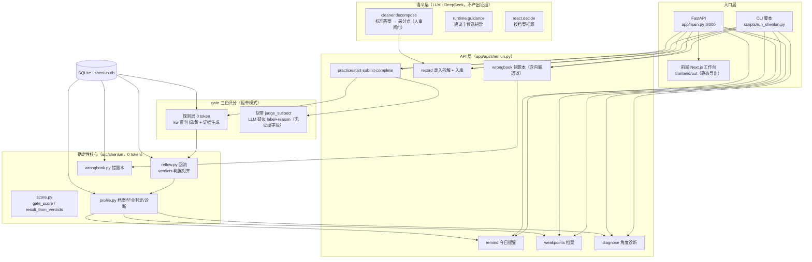

# PointLoop（逐点）

申论作答的逐点评分与错题回流工具。仓库与 Python 包名沿用历史命名 `offerloop`，产品名为 PointLoop（逐点），两者不对应属正常情况。

## 项目定位

申论按采分点给分。本项目做的事是：给定题目与标准答案，把标准答案拆成采分点，对作答逐点输出「命中 / 漏答 / 疑似」三色判定与可回溯证据，漏掉的点进入本地薄弱点档案，并按遗忘间隔出现在后续练习提醒中。

输入 / 输出边界：

- 输入：题目 + 标准答案（库内金标 / 手填 / LLM 拆解三种来源自动分层）+ 考生作答。
- 输出：逐点三色判定与证据、漏点清单、错题本、基于薄弱档案的每日提醒。
- 不输出：精确分数、范文、押题内容。

评分定位是「漏点识别传感器」，只回答"这个点写了没有、证据在哪"，不回答"这句话写得好不好"。

## 当前能力与边界

| 能力 | 说明 | 状态 |
|------|------|------|
| 标准答案拆解为采分点 | LLM 拆解，默认不通过，人工审核后入库；采分点带来源分层（L1 库题金标 / L2 手填 / L3 LLM 拆解「参考·未复核」） | 已实现 |
| gate 三色评分 | 规则层关键词直判绿（命中）/ 黄（漏答），0 token 且同步生成证据；灰带（部分命中）交 LLM 标「疑似」，仅输出 label+reason，无证据字段 | 已实现 |
| 库题防伪 | 前端声明的 `question_id` 须与库内题采分点全量比对一致，否则拒绝——防「自称真题塞自造采分点」 | 已实现 |
| 错题回流 | 库内题按 gate 判据入库（与展示判定一致）；内联题无回流通道，漏点只进错题本 | 已实现 |
| 薄弱点档案与生命周期 | 漏点自动入档，毕业 / 隔离 / 钉住 / 复活全生命周期受控 | 已实现 |
| 每日提醒 | 按紧急度（弱点权重 × 遗忘程度）动态排序推送 | 已实现 |
| 能力诊断 | 题型 / 采分角度两层聚合统计已就绪 | 部分（逐级下钻与同类题推荐待做） |
| 语义检索（练同类题） | 基于 embedding 的同类题召回 | 未完成 |

## 评分机制：为什么不是"LLM 直接判分"

早期版本由 LLM 直接判定采分点命中与否并生成证据，实测发现一类错误：作答中**没有写**的点被 LLM 判为命中，且填充的证据是**材料原文的句子**（作答里不存在、材料里逐字存在）——即"材料顶包"。根因是 LLM 同时承担证据生成与裁判两个角色，上下文里存在材料时，找不到作答证据就会借用。

修复方式是结构性拆分角色，而非增加提示词约束：

| 角色 | 职责 | 可伪造面 |
|------|------|----------|
| 规则层（0 token） | 生成全部证据：命中词 / 缺失词 / 材料锚句 | 无（字符串比对，可回溯） |
| LLM（灰带） | 仅输出 `label + reason` 的「疑似」标注 | 无（无证据字段） |
| LLM（建议卡） | 生成候选措辞，明示「供参考」 | 无（建议非事实） |

原则：**凡作为事实展示的内容（命中与否、漏了哪些词、对应材料哪句），全部由确定性规则生成；LLM 只保留不产出事实的职责。** 评分、回流、排序、毕业判定因此可复现、可测试。

## 单模式评分与来源分层

评分恒为 gate 三色，不按题目来源切模式（旧 trusted 双模式与示证档已退役，代码保留 deprecated 仅作回滚保底）。可信度下沉为数据属性 `points_source`，三层分流：

| 层 | 来源 | 评分 | 漏点去向 |
|----|------|------|----------|
| L1 | 库内题金标（official / human_approved，qid + 采分点全量比对通过） | gate 三色完整评分 | 回流薄弱档案 → 提醒池 |
| L2 | 用户手填采分点 | gate 三色完整评分 | 漏点只进错题本 |
| L3 | LLM 拆解未经人审（「参考·未复核」） | gate 三色完整评分，界面带 caveat | 漏点只进错题本 |

- 红线：只有 L1 进记忆闭环；内联题调用回流接口直接 404。
- 建议卡对 L1/L2/L3 全放开，L3 措辞带「未复核」caveat。

## 数据与记忆

- 每次作答写入 `answers` 与 `answer_rounds`（逐轮轨迹）。
- 库内题漏点（黄档 + 疑似按 miss 入库）更新薄弱点档案；疑似必留 `events` suspect 溯源行，再练命中即复活；内联漏点只进错题本。
- 薄弱点生命周期：连续命中 3 次 + 间隔 ≥7 天 → 毕业考，命中即毕业（移出提醒池，档案保留）；30 轮仍不达标 → 隔离；用户可手动钉住。
- 提醒排序使用紧急度公式（弱点权重 × 遗忘程度），不是静态清单。
- 记忆闭环有固定回归：eval memory 套件 10 场景 22 检查项（见下「评测」）。

## 评测

`eval/` 下按套件评测（`python scripts/run_evals.py`），结果归档 `eval/results/<run_id>/`，支持 BEFORE→AFTER 对比。

| 套件 | 测什么 | 最近登记 |
|------|--------|----------|
| score | 评分区分力：好答 vs 跑题答 | no_fool 1.0 / discrimination 0.899（36 题 · 213 点）⚠️ |
| decompose | 拆解质量：金标对照 + 脏标答鲁棒性 | recall 0.884 / fabrication 0.048 / structural 1.0 / dirty 1.0 |
| demo | 引导质检：材料锚定 / 红线 | material_anchored 1.0 / no_full_answer 1.0 / no_fabrication 1.0 |
| medium | 语义冒烟：fuzzy 漏判 / nosource 假阳 | fuzzy_miss 0.75 / nosource_fp 1.0 ⚠️ |
| memory | 记忆闭环生命周期：毕业 / 隔离 / 复活 / 遗忘排序 / 疑似溯源 / 内联零通道 | 达标 22/22（10 场景 · 0 token）· 红线 0（2026-09-08） |

口径说明：

- ⚠️ `score` / `medium` 两条基线基于已退役的旧引擎（LLM 判官时代，即暴露"材料顶包"的版本）。评分口径按 `docs/38` 的 D50 重建中：规则层（绿∪黄）对金标 hit/miss 的一致性 + 灰带疑似标注质量 + no_fool/nosource 回归。
- `decompose`（拆解）与 `demo`（引导措辞）口径未变，仍有效；`memory` 为记忆闭环生命周期固定回归（2026-09-08 口径冻结，10 场景 × 22 检查项，含内联零回流与疑似必溯源两条红线）。
- 指标设计：一票否决类（no_fool / no_fabrication / dirty / 内联泄漏 / 疑似缺溯源）需等于红线值才发版；能力类（recall / discrimination / memory_pass_rate）在阈值之上追求更高。这些指标用于验证"漏点识别是否可靠"，不是对提分效果的承诺。

## 测试

`tests/` 下 403 个 pytest 用例，覆盖评分 gate、疑似标注、回流、档案生命周期、错题本、API 契约等模块。

```bash
python -m pytest -q
ruff check src tests
```

## 安装

前置条件：Python 3.13+，一个 DeepSeek API Key（用于拆解 / 灰带疑似标注 / 建议候选 / 推题决策）。gate 的绿 / 黄判定与全部记忆链路是本地确定性代码，不调用 LLM。

```bash
# 1. 后端
cd offerloop
python -m venv .venv
# Windows: .venv\Scripts\activate
source .venv/bin/activate
pip install -e .                 # 运行时依赖
pip install -e ".[dev]"          # 开发模式（pytest / ruff）

# 2. 环境变量：仓库不提交 .env，需手动创建（offerloop/ 下）
# .env 内容：
#   DEEPSEEK_API_KEY=sk-xxx

# 3. 前端（可选，只用 CLI 可跳过）
cd frontend
npm install
npm run build                    # 静态导出到 frontend/out，由后端托管
```

## 使用

```bash
# CLI
python scripts/run_shenlun.py --demo        # 完整闭环演示：拆解 → 评分 → 回流 → 建议
python scripts/run_shenlun.py --advice      # 今日建议（该练什么）
python scripts/run_shenlun.py --list        # 列出题库
python scripts/run_decompose_question.py    # 拆解 + 逐点人工审核（确认/改分/删/新增）

# Web（工作台）
uvicorn app.main:app --host 0.0.0.0 --port 8000
# 浏览器打开 http://localhost:8000/workbench
```

Web 模式默认只起后端（前端 `frontend/out` 由 `app/main.py` 托管）。开发时热更新前端：另开终端 `cd frontend && npm run dev`（端口 3000，自动代理 `/api` 到 8000）。

## 系统架构



旧示证档 `align.py` 已退役，代码保留 deprecated 仅作回滚保底，不参与主链路。

## 目录结构

```
offerloop/
├── app/
│   ├── main.py              # FastAPI 入口（托管 /api/* + 前端静态页）
│   └── api/
│       ├── shenlun.py       # 申论 API（练习/提醒/档案/录入/错题本/gate 评分）
│       └── …                # 历史遗留 API（不参与申论主链路，待清理）
├── src/
│   ├── shenlun/             # 申论核心（确定性层 + 语义层路由）
│   │   ├── score.py         # kw 硬匹配/材料锚/gate_score/result_from_verdicts
│   │   ├── judge_llm.py     # 灰带疑似标注（无证据字段）
│   │   ├── reflow.py        # 回流（answers/weak_points/events + 记忆生命周期）
│   │   ├── wrongbook.py     # 错题本（含内联通道）
│   │   ├── profile.py       # 档案聚合 + 毕业判定 + diagnose
│   │   ├── question_store.py# 题库加载 + 用户题入库（人审闸门）
│   │   ├── align.py         # 已退役（deprecated，回滚保底）
│   │   └── react.py         # 决策（按档案推题）
│   ├── cleaner/             # 拆解（decompose/precheck/annotate）
│   └── mock/                # 练习会话运行态（runtime/guidance/report）
├── eval/                    # 评测套件 + results 归档
├── benchmark/               # 金标题库（36 题：河南官方 2024/2025 + 江苏）+ medium 金标集
├── frontend/                # Next.js 工作台
├── scripts/                 # CLI 入口
└── docs/                    # 开发记录（01-43 计划书 + 实施计划 + CHANGES 交接）
```

`src/memory`、`src/market` 与 `app/api` 下部分模块为历史遗留，不参与申论主链路，保留未删、待清理。

## 技术栈

- 后端：Python 3.13 · FastAPI · SQLite
- LLM：DeepSeek API（拆解 / 灰带标注 / 建议候选 / 决策，温度 0）
- 前端：Next.js（静态导出）· Tailwind 4 · React 19
- 数据：全部本地 SQLite（`data/shenlun.db`），不出本机

## 开发计划

- Now：D50 评测基线重建（gate 绿∪黄对金标一致性 + 灰带疑似质量，替换已退役旧基线）；前端接入 `practice/complete`（verdicts 回传，判据对齐打通最后一公里）
- Next：能力诊断下钻、备考提醒增强
- Later：进步可视化、套卷模式、语义检索（同类题推荐）

## 不做的事（Non-goals）

- 不爬取题库内容
- 不生成范文 / 代写作答
- 不做社区 / 排行榜
- 不承诺保过或提分

## 常见问题

**绿 / 黄判定可靠吗？**
绿（全部关键词命中）与黄（关键词未写全）由确定性规则判定，0 token、可复现；只有灰带（部分命中）会交 LLM 标「疑似」且不硬判。系统不对"写得好不好"做精确判断。

**为什么不用 LLM 直接判命中 / 漏答？**
见上文"评分机制"：LLM 在材料存在时会借用材料原文把未写的点判为命中（材料顶包）。LLM 适合软标注（疑似），不适合产出要作为事实展示的证据。

**LLM 拆的采分点可信吗？**
默认不可信。拆解结果 `approved=False`，人工审核（确认 / 改分 / 删 / 新增）通过后才入库评分；未经人审的拆解自动标 L3「参考·未复核」，其漏点只进错题本、不进记忆闭环。

**练习会忘怎么办？**
薄弱点按紧急度公式排序进入每日提醒；连续命中 + 间隔验证通过毕业考后毕业；长期补不上会隔离。灰带疑似入库必留溯源行，再练命中即复活。

**需要 GPU 或本地模型吗？**
不需要。确定性判定在本地执行，其余走 DeepSeek API。

**为什么包名是 offerloop？**
历史命名保留（改包名牵动全部 import 与脚本，收益低），产品名以 PointLoop 为准。

## License

MIT
