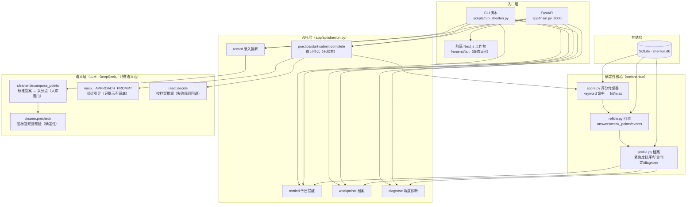

# OfferLoop —— 申论陪练 Agent（记得你漏了哪些采分点）

> **一句话**：申论按点给分，提分 = 多踩点。OfferLoop 是一个「记得你」的申论陪练——自动拆解标准答案为采分点，客观比对你的作答漏了哪些点、总漏哪类角度，按遗忘状态主动提醒你练，练完不白练。

---

## 项目简介

申论备考最典型的状态：**练了很多题，但不知道每题到底漏了哪几个采分点；今天补上的点，下周又忘了；错题散在纸上、文档里，从不回看。**

OfferLoop 解决这三件事：

1. **练完立刻知道漏了什么**：评分是**客观采分点比对**（确定性传感器，不依赖 LLM 打分）——你的作答 vs 标准答案拆出的采分点，逐个判定 hit/miss，绝不靠"感觉"。
2. **知道自己总漏哪一类**：跨题型按角度聚合（对策 / 原因 / 影响 / 意义…）——"你不是某题型弱，是总漏『对策可行性』这种角度"。
3. **漏的点不遗忘**：薄弱点带生命周期（练到连续命中 + 间隔验证就毕业，补不上的隔离提示），按遗忘状态动态提醒你练，而不是躺在列表里吃灰。

它的内核不是一个「存了什么就给你什么」的静态题库，而是一个**会遗忘、会主动推送的 Agent**：

- **评分传感器**：确定性 hit/miss 判定（`score_answer`），36 题金标评测 no_fool=1.0、discrimination=0.899——能稳定区分好答 vs 跑题答，且不被流畅长文误导。
- **拆解 + 人审闸门**：LLM 把标准答案拆成采分点（默认不通过），人工审核确认后才成为可信金标——防"LLM 拆点 → LLM 判分"的循环论证。
- **逼近引导**：漏了哪个点，LLM 只提示「材料第 X 段有相关内容」——不代写、不漏底，守"陪练不是代练"红线。
- **记忆引擎**：薄弱点按紧急度（弱点权重 × 遗忘程度）排序，毕业 / 隔离 / 置顶三个出口，档案永远保留、提醒策略动态变化。
- **主动性**：ReAct 决策按薄弱档案推题，带推荐理由——「你『对策』角度漏点最多，推一道归纳概括题」。

**别人回答「考什么」，OfferLoop 回答「你现在还差什么、差在哪类、练完会不会忘」。**

---

## 核心能力

| 能力 | 说明 | 是否 Agent 内核 |
|------|------|----------------|
| **客观采分点评分** | 作答 vs 金标逐点 hit/miss，确定性判定，不调 LLM | ✅ 是（地基） |
| **标准答案拆解 + 人审** | LLM 拆点（默认不通过）→ 人工审核 → 可信金标 | ✅ 是（数据可信） |
| **动态遗忘提醒** | 按紧急度公式主动推「今天该练什么」，毕业考候选自动安排 | ✅ 是 |
| **逼近引导** | 漏点引导只给材料位置，不代写答案（no_spoiler 红线评测兜底） | ✅ 是 |
| **薄弱点生命周期** | 练到连续命中+间隔验证毕业；补不上隔离并建议检查题目质量 | ✅ 是 |
| **角度诊断（L2）** | 跨题型按角度聚合：总漏「对策」这类可迁移能力 | ✅ 是 |
| 多轮练习会话 | 抽题 → 作答 → 评分 → 引导 → 回流，断点续练 | ❌ 交互外壳 |
| 工作台前端 | 左选项卡（工作台/练习/档案/录入）+ 右内容，碎片化备考 | ❌ 展示层 |

**Non-goals（永久不做）**：不爬题库、不 AI 代写范文、不做社区/排行榜、不承诺保过或提分 N 分。

---

## 效果展示

**今日提醒（按遗忘状态动态分层，不是写死的清单）：**

```
📋 今日提醒
🎓 毕业考候选 · 设施互通（连续命中 3 次，7 天未验证，建议安排一次验证）
🔴 该练了 · 产业协同（4 天前练过，遗忘风险升高）
🔴 该练了 · 服务共享（3 天前练过）

角度诊断：你总漏「对策」这类（5 点 · 漏 5 次）>「影响」（4 点 · 漏 3 次）
```

**一次练习会话（评分是确定性输出，引导是 LLM 提示）：**

```
AI: 【归纳概括 · 20 分】给定资料 1-4 中，一些地方和部门借鉴传统文化中的智慧赋能
    现代社会治理，请用一段话归纳概括其成效。
    （推荐理由：你「对策」角度漏点最多）      → 请作答（第 1 轮 / 共 3 轮）

你: 大山村借用"六尺巷"化解土地纠纷，小雪街道成立"和为贵"调解室减少邻里纠纷，
    梅林村落实河长制改善水质，Z市延续耕读传统建设书香城市。

AI: 评分（确定性传感器）→ 命中 3/5 点，漏 2 点
    ✓ 六尺巷  ✓ 河长制  ✓ 耕读    ✗ 和为贵·调解室  ✗ 生态理念·象群

AI: 逼近引导（只提示不漏底）
    ① 和为贵·调解室：材料第 2 段有"和为贵"调解室的例子，想想邻里纠纷怎么化解的
    ② 生态理念·象群：材料第 3 段 Y 省保障象群南返，体现了什么理念
```

---

## 应用场景

- **在职碎片化备考**（通勤 / 午休 15-30 分钟）：打开工作台看今日提醒 → 练一道 → 评分引导 → 随时退出，断点续练。
- **练完不白练**：每次作答自动回流薄弱点档案，漏点计入提醒池，第二天自动出现在「该练了」。
- **考前突击**：只练红色（稳定漏点）+ 毕业考候选，把有限时间花在真正没掌握的角度上。
- **录入自己的题**：粘贴题目 + 标准答案 → 拆解采分点预览 → 人审入库 → 立刻能练。

---

## 安装部署

### 方式一：让 AI 帮你装（最简单）

如果你在用 WorkBuddy / Claude / Codex 这类智能体，直接说：

> 「帮我在 D:\AIWorkspace\OfferLoop\offerloop 里装好运行环境，配好 .env」

智能体会自动创建虚拟环境、装依赖、写配置。

### 方式二：脚本安装

```bash
# 1. 后端（Python 3.13）
cd offerloop
python -m venv .venv && source .venv/bin/activate        # Windows: .venv\Scripts\activate
pip install -e .                                        # 运行时依赖
# 开发模式（含 pytest / ruff）：
pip install -e ".[dev]"

# 2. 前端（Next.js，可选；只用 CLI 可跳过）
cd frontend
npm install
npm run build      # 静态导出到 frontend/out，由后端统一托管

# 3.（仅面试域遗留模块需要）本地嵌入模型 Ollama：
ollama pull shaw/dmeta-embedding-zh:latest
```

### 方式三：手动安装

```bash
pip install fastapi uvicorn openai pydantic python-dotenv pypdf python-multipart

# 配置：复制环境变量模板并填入你的 DeepSeek Key
cp .env.example .env
# 编辑 .env：DEEPSEEK_API_KEY=sk-xxx
```

> **前置要求**：一个 DeepSeek API Key（云端推理：拆解 / 引导 / ReAct 决策）。评分是确定性本地判定，不调 LLM。**练习数据全部存本地 SQLite（shenlun.db），不出本机。**

---

## 快速开始

```bash
# —— CLI 模式（演示完整闭环）——
python scripts/run_shenlun.py --demo        # 自动演示：拆解 → 评分 → 回流 → 建议
python scripts/run_shenlun.py --advice      # 只出今日建议（该练什么）
python scripts/run_shenlun.py --list        # 列出题库

# —— Web 模式（工作台）——
uvicorn app.main:app --host 0.0.0.0 --port 8000
# 浏览器打开 http://localhost:8000/workbench
```

> Web 模式默认只起后端即可：前端 `frontend/out` 已由 `app/main.py` 托管（单进程单端口）。
> 开发时想热更新前端，另开一个终端 `cd frontend && npm run dev`（3000，自动代理 `/api` 到 8000）。

---

## 使用说明

### 1. 练一道（练习会话，核心闭环）

- **Web**：工作台 →「练习」tab → 开始练习（ReAct 按薄弱档案推题）→ 作答 → 评分（命中/漏点）→ 引导 → 达标或 3 轮上限 → 完成回流。
- **CLI**：`python scripts/run_shenlun.py`（交互式，一次一题，随时退出续练）。

每条作答自动写 `answers` + `answer_rounds`（逐轮轨迹），漏点更新进薄弱点档案。

### 2. 录入题目（标准答案 → 拆解 → 人审）

- **Web**：工作台 →「录入」tab：粘贴题目 + 标准答案 → 拆解采分点预览 →（人审闸门在 CLI 工具）→ 入库后可练。
- **CLI**：`python scripts/run_decompose_question.py`（拆解 + 逐点人工审核：确认/改分/删/新增）。

### 3. 看档案 / 今日提醒

- **Web**：工作台 →「工作台」tab 看提醒与角度诊断；「档案」tab 看薄弱点全表（激活/卡住/毕业/置顶筛选）。
- **CLI**：`python scripts/run_shenlun.py --advice`。

---

## 系统架构



**设计原则（最关键的一句）**：

> **LLM 只做语义活（拆解 / 引导 / 决策），评分 / 回流 / 排序 / 毕业判定全是确定性纯函数**——数字可复现、可测试、可基准评测，不靠 LLM 编。脏文本检测（乱码/错别字）用规则预检，绕开 LLM 的字符层不稳定。

---

## 评测体系（评测闭环，可回归）

三个 eval 套件（`scripts/run_evals.py`），每次改动跑一遍即出 BEFORE→AFTER：

| 套件 | 测什么 | 基线（2026-08-29 登记） |
|------|--------|------------------------|
| **score** | 评分传感器：好答 vs 跑题答区分力 | no_fool **1.0** / discrimination **0.899** |
| **decompose** | 拆解质量：金标对照 + 脏标答鲁棒性 | recall **0.891** / fabrication **0.056** / structural **0.981** / dirty **1.0** |
| **guidance** | 逼近引导红线 + 质量 | no_spoiler **1.0** / no_fabrication **1.0** / hint_grounded **1.0** |

指标设计原则：一票否决类（no_fool / no_spoiler / dirty）==1.0 才发版；能力类（recall / discrimination）在阈值之上追求更高；评测数据规模跟结论匹配（正确性全量、行为验证抽样）。

---

## 技术栈

- **后端**：Python 3.13 · FastAPI · SQLite（练习/档案/事件）
- **LLM**：DeepSeek API（拆解 / 逼近引导 / ReAct 决策，温度 0）
- **前端**：Next.js（静态导出）· Tailwind 4 · React 19
- **评测**：pytest（284+ 用例）· eval 三套件 · run_evals 归档对比
- **遗留**：面试域模块（src/memory、src/mock 面试部分）保留未删，作为产品演进史，不参与申论主链路

---

## 项目结构

```
offerloop/
├── app/
│   ├── main.py              # FastAPI 入口（托管 /api/* + 前端静态页）
│   └── api/
│       ├── shenlun.py       # 申论工作台 API（练习/提醒/档案/录入）
│       └── …                # 面试域 API（遗留）
├── src/
│   ├── shenlun/             # 申论核心（确定性层）
│   │   ├── score.py         # 评分传感器
│   │   ├── reflow.py        # 回流（answers/weak_points/events）
│   │   ├── profile.py       # 档案聚合 + 毕业判定 + diagnose
│   │   └── react.py         # ReAct 决策（按档案推题）
│   ├── cleaner/             # 拆解
│   │   ├── decompose.py     # decompose_points（LLM 拆点）
│   │   ├── precheck.py      # 脏标答规则预检（确定性）
│   │   └── annotate.py      # 人审闸门
│   └── mock/                # 练习会话 + 逼近引导
├── eval/                    # 评测三套件 + 归档
├── benchmark/data/          # 金标题库（36 题：河南官方 + 江苏）
├── frontend/                # Next.js 工作台
├── scripts/                 # CLI 入口
└── docs/                    # 开发计划书（01-20）
```

---

## 配置说明

| 配置 | 位置 | 说明 |
|------|------|------|
| `DEEPSEEK_API_KEY` | `.env` | 云端推理（拆解/引导/决策） |
| `shenlun.db` | `data/` | 练习/档案/事件（本地，自动创建） |
| `USER_QUESTIONS_DIR` | `data/user_questions/` | 用户录入的题（人审通过后入库） |

---

## 安全设计

- **数据全本地**：练习数据、薄弱点档案存本地 SQLite，不出本机。
- **LLM 权限最小化**：只把「题目 + 作答 / 标准答案」发给 DeepSeek，从不发送简历 / JD 等个人信息；答辩侧对「示例作答」脱敏。
- **拆解防循环论证**：LLM 拆的点默认 `approved=False`，人审通过才入库评分——自动拆的不可全信，来源可追溯（official / human_approved / llm_draft）。
- **输入鲁棒性**：脏标答规则预检（乱码/错别字/过短）在拆解前拦截，不把垃圾当金标。

---

## 项目亮点（面试讲点）

1. **客观评分 vs 竞品 LLM 主观判分**：评分是确定性采分点比对（可基准评测，no_fool=1.0），LLM 只做拆解/引导/决策——「我知道 LLM 判分不可信，所以评分交给确定性传感器」。
2. **防循环论证的工程实现**：LLM 拆的点默认不通过，人审闸门 + 来源标记；脏文本用规则预检绕开 LLM 字符层不稳定。
3. **记忆机制是 Agent 内核**：紧急度公式（弱点权重 × 遗忘程度）+ 毕业/隔离/置顶生命周期 + ReAct 主动推题——不是静态错题本。
4. **评测闭环**：三套件 eval + baseline 回归对比，每次改动有 BEFORE→AFTER 物证；校准全部实测驱动（首轮 structural 0.329 → 校准规则后 0.981）。
5. **产品演进治理**：从面试错题本迁移到申论评审 Agent，平行新增不破坏旧链路，评测体系跟着产品一起申论化。

---

## Roadmap

**Now（当前）**：工作台前端收尾（练习引导态 / 档案看原题 / 录题即练闭环）、移动端形态
**Next**：能力诊断下钻（角度 → 薄弱点 → 同类题推荐）、备考提醒增强、评分后下一步动作
**Later**：进步可视化、五维辅助、套卷模式、语义检索（练同类题推荐）

---

## 贡献指南

```bash
# 安装开发依赖
pip install -e ".[dev]"

# 跑测试 + 检查
python -m pytest -q
ruff check src tests

# 跑评测（3 套件 + 归档对比）
python scripts/run_evals.py
python scripts/run_evals.py --baseline   # 把当前结果登记为对比锚点
```

---

## FAQ

**Q：评分准吗？**
A：评分 = 客观采分点比对（确定性，不调 LLM）。36 题金标评测：no_fool=1.0（无跑题答被误判满分）、discrimination=0.899（好答平均比跑题答多命中九成点）。它回答"漏了哪几个点"（hit/miss），不追求精确分数。

**Q：LLM 拆的采分点可信吗？**
A：默认不可信——`approved=False`，人工审核（确认/改分/删/新增）通过后才成为金标；来源标记区分 official / human_approved / llm_draft，档案统计可按来源过滤。

**Q：练习会忘怎么办？**
A：薄弱点带生命周期：连续命中 3 次 + 7 天间隔验证 → 毕业移出提醒池（档案保留）；补不上 30 轮 → 隔离并建议检查题目质量；随时可复活。提醒按紧急度动态排序，不无差别推。

**Q：需要 GPU / 本地模型吗？**
A：不需要。评分与脏文本预检是确定性本地代码，拆解/引导/决策走 DeepSeek API。Ollama 嵌入模型仅面试域遗留模块使用。

---

## License

MIT
